<p align="center">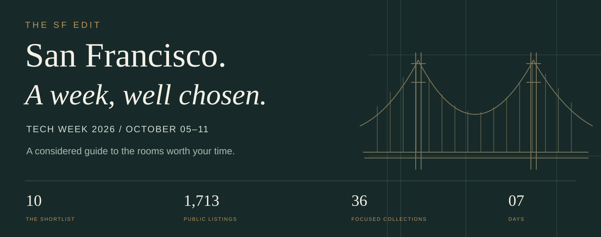</p>

<p align="center"><b>THE SHORTLIST. THE CITY. YOUR WEEK.</b></p>
<p align="center"><a href="#the-shortlist">The ten</a> · <a href="#find-your-room">Collections</a> · <a href="https://hamedrabah.github.io/sf-tech-week-2026/">Subscribe to a calendar</a> · <a href="docs/all-events.md">All events</a></p>

A considered edit of SF Tech Week. Start with ten selected rooms, then explore **36 focused collections** across the full **1,713-event** calendar. October 5–11, 2026. San Francisco and the Bay Area. All times Pacific.

If this guide helps you plan your week, [star the repository](https://github.com/hamedrabah/sf-tech-week-2026) so you can find it again.

## The shortlist

Ten picks for founders, builders, investors, and operators. Each links directly to the organizer's application. All ten require approval; the investor breakfast is invite-only. Selection is editorial, and admission remains with the host.

<table>
<tr>
<td width="50%" valign="top"><a href="https://partiful.com/e/XaBTYkfWChPrquuI6uPH">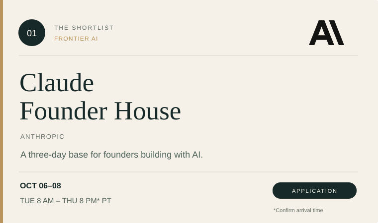</a><br><a href="https://partiful.com/e/XaBTYkfWChPrquuI6uPH">Apply ↗</a> · <a href="docs/seed-picks.md#claude-founder-house">Details &amp; timing</a></td>
<td width="50%" valign="top"><a href="https://partiful.com/e/Fp4oMyFGQC6HzotKXc8T">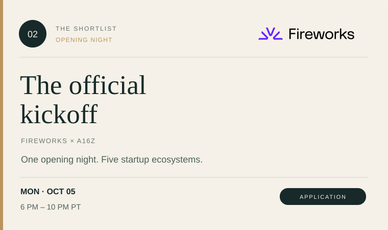</a><br><a href="https://partiful.com/e/Fp4oMyFGQC6HzotKXc8T">Apply ↗</a> · <a href="docs/seed-picks.md#official-tech-week-kickoff">Details &amp; timing</a></td>
</tr>
<tr>
<td width="50%" valign="top"><a href="https://partiful.com/e/9VljRP0TkkEpT8B3jcVF">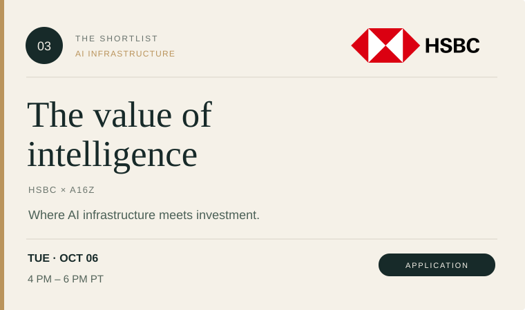</a><br><a href="https://partiful.com/e/9VljRP0TkkEpT8B3jcVF">Apply ↗</a> · <a href="docs/seed-picks.md#capturing-value-intelligence">Details &amp; timing</a></td>
<td width="50%" valign="top"><a href="https://partiful.com/e/WrF0Hv7cZLnp5fHzjYAC">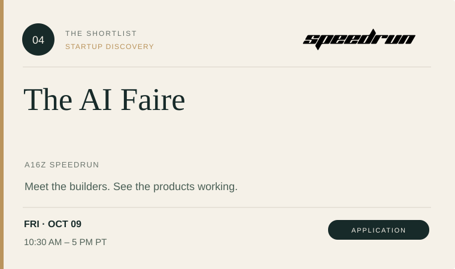</a><br><a href="https://partiful.com/e/WrF0Hv7cZLnp5fHzjYAC">Apply ↗</a> · <a href="docs/seed-picks.md#speedrun-ai-faire">Details &amp; timing</a></td>
</tr>
<tr>
<td width="50%" valign="top"><a href="https://partiful.com/e/l2OOsMB3MHZJ9b8lzhmq">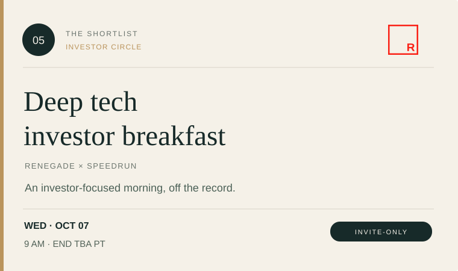</a><br><a href="https://partiful.com/e/l2OOsMB3MHZJ9b8lzhmq">Apply ↗</a> · <a href="docs/seed-picks.md#deep-tech-investor-breakfast">Details &amp; timing</a></td>
<td width="50%" valign="top"><a href="https://partiful.com/e/xK3d559vfUGIIipkw8yp">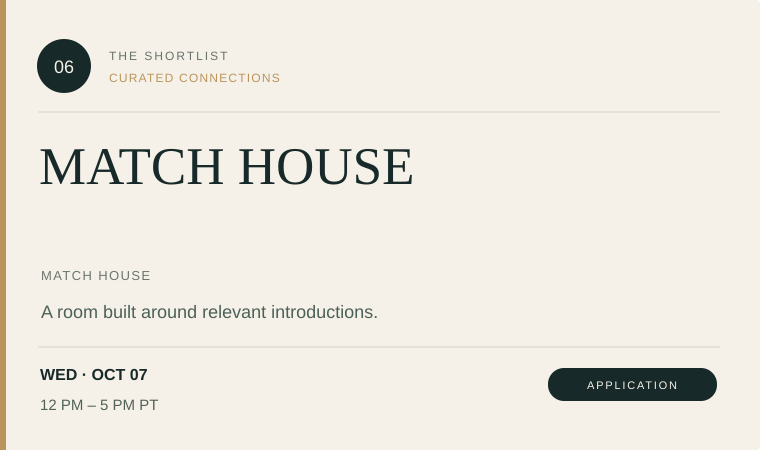</a><br><a href="https://partiful.com/e/xK3d559vfUGIIipkw8yp">Apply ↗</a> · <a href="docs/seed-picks.md#match-house">Details &amp; timing</a></td>
</tr>
<tr>
<td width="50%" valign="top"><a href="https://partiful.com/e/wgzQaLCyAPobkZnJpzOP">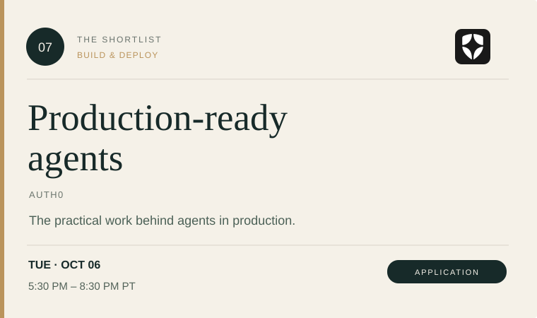</a><br><a href="https://partiful.com/e/wgzQaLCyAPobkZnJpzOP">Apply ↗</a> · <a href="docs/seed-picks.md#camp-ai-production-ready-agents">Details &amp; timing</a></td>
<td width="50%" valign="top"><a href="https://partiful.com/e/GS2y8UzXQRzCZEw0M1ya">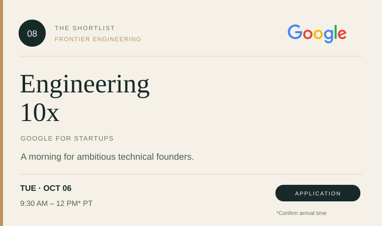</a><br><a href="https://partiful.com/e/GS2y8UzXQRzCZEw0M1ya">Apply ↗</a> · <a href="docs/seed-picks.md#google-engineering-10x">Details &amp; timing</a></td>
</tr>
<tr>
<td width="50%" valign="top"><a href="https://partiful.com/e/uJMR8t2zTYWJiNyS7VLp">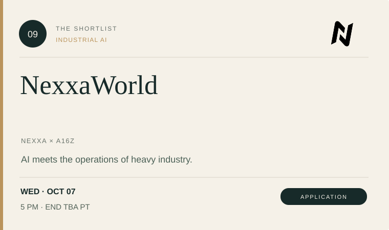</a><br><a href="https://partiful.com/e/uJMR8t2zTYWJiNyS7VLp">Apply ↗</a> · <a href="docs/seed-picks.md#nexxaworld">Details &amp; timing</a></td>
<td width="50%" valign="top"><a href="https://partiful.com/e/xoXjF4aybCw6UY4XxY80">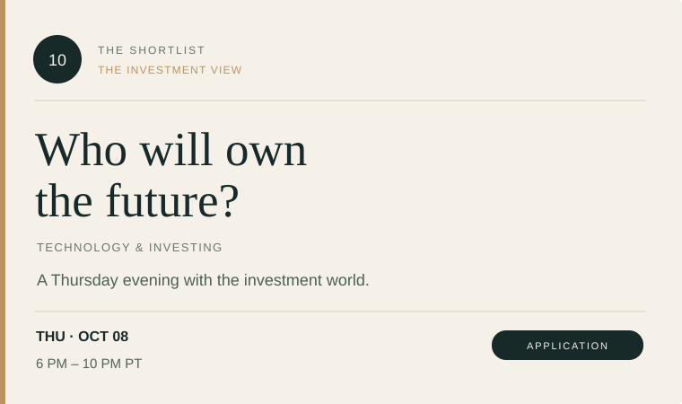</a><br><a href="https://partiful.com/e/xoXjF4aybCw6UY4XxY80">Apply ↗</a> · <a href="docs/seed-picks.md#who-will-own-future">Details &amp; timing</a></td>
</tr>
</table>

<p align="center"><a href="https://hamedrabah.github.io/sf-tech-week-2026/#top-10"><b>Subscribe to the shortlist →</b></a> · <a href="https://hamedrabah.github.io/sf-tech-week-2026/calendars/top-10.ics">Download the ten (.ics)</a> · <a href="docs/seed-picks.md">Read the selection notes</a></p>

<sub>*Claude's daily café description begins at 11 AM despite its 8 AM event header; Google's description mentions 9 AM despite its 9:30 AM header. Confirm arrival with the host. The breakfast and NexxaWorld publish no end time. Prices are unconfirmed.</sub>

## Find your room

Smaller collections, each with its own list and calendar. Every event has one primary home; collections currently hold **16–113 events**. Placement follows the public title's topic, audience, or format and is editorial, not an organizer classification.

| Collection | Events | Collection | Events |
| --- | ---: | --- | ---: |
| [Agents & automation](docs/collections/agents-and-automation.md) | 54 | [Real estate & the built world](docs/collections/real-estate-and-built-world.md) | 17 |
| [Models & evaluation](docs/collections/models-and-evaluation.md) | 27 | [Sales, GTM & customer success](docs/collections/sales-and-gtm.md) | 55 |
| [Compute & cloud](docs/collections/compute-and-cloud.md) | 34 | [Marketing, brand & growth](docs/collections/marketing-and-growth.md) | 60 |
| [Data, memory & search](docs/collections/data-memory-and-search.md) | 21 | [Fundraising, pitches & exits](docs/collections/fundraising-and-pitches.md) | 54 |
| [Voice & conversational AI](docs/collections/voice-and-conversation.md) | 22 | [Investors, funds & capital](docs/collections/investors-and-capital.md) | 36 |
| [Coding & developer tools](docs/collections/coding-and-devtools.md) | 33 | [Global founders & cross-border growth](docs/collections/global-founders.md) | 78 |
| [Security, trust & governance](docs/collections/security-and-governance.md) | 29 | [Women & underrepresented communities](docs/collections/inclusive-communities.md) | 39 |
| [Enterprise AI & workflows](docs/collections/enterprise-ai.md) | 27 | [Careers, teams & leadership](docs/collections/careers-and-leadership.md) | 67 |
| [Product, design & UX](docs/collections/product-and-design.md) | 37 | [Founder practice & cofounders](docs/collections/founder-practice.md) | 30 |
| [Creative AI, media & storytelling](docs/collections/creative-media.md) | 49 | [Hackathons & hands-on builds](docs/collections/hackathons-and-builds.md) | 30 |
| [Consumer, commerce & experiences](docs/collections/consumer-and-commerce.md) | 45 | [Demos, launches & showcases](docs/collections/demos-and-showcases.md) | 37 |
| [Health, biotech & medicine](docs/collections/health-and-biotech.md) | 70 | [Coffee, breakfasts & daytime socials](docs/collections/coffee-and-daytime-socials.md) | 62 |
| [Wellbeing, longevity & reset](docs/collections/wellbeing-and-longevity.md) | 64 | [Dinners & small-table conversations](docs/collections/dinners-and-small-tables.md) | 42 |
| [Robotics, hardware & physical AI](docs/collections/robotics-and-hardware.md) | 95 | [Mixers & happy hours](docs/collections/mixers-and-happy-hours.md) | 113 |
| [Climate, energy & frontier science](docs/collections/climate-and-frontier-tech.md) | 30 | [Parties, games & culture](docs/collections/parties-and-play.md) | 77 |
| [Fintech, payments & crypto](docs/collections/fintech-and-payments.md) | 39 | [Sports, walks & outdoors](docs/collections/sports-and-outdoors.md) | 77 |
| [Finance, legal & business operations](docs/collections/finance-legal-and-operations.md) | 42 | [AI perspectives & big questions](docs/collections/ai-perspectives.md) | 40 |
| [Education, civic tech & impact](docs/collections/education-and-public-good.md) | 16 | [Open houses, clubs & discovery](docs/collections/open-discovery.md) | 65 |

[Browse collection descriptions](docs/collections.md) · [Explore twenty more picks](docs/more-picks.md) · [Official curated tracks](docs/tracks.md)

## Put it on your calendar

**[Open the calendar desk →](https://hamedrabah.github.io/sf-tech-week-2026/)**

Choose the ten, a collection, a single day, or the full week. Subscribe for future revisions to this guide, or download an `.ics` file for a one-time import into Apple Calendar, Google Calendar, Outlook, and other calendar apps.

| Feed | Subscribe / copy URL | Export |
| --- | --- | --- |
| The shortlist · 10 events | [Calendar desk](https://hamedrabah.github.io/sf-tech-week-2026/#top-10) | [Download .ics](https://hamedrabah.github.io/sf-tech-week-2026/calendars/top-10.ics) |
| Your interests · 36 collections | [Choose a collection](https://hamedrabah.github.io/sf-tech-week-2026/#collections) | Each collection has an export |
| A single day | [Choose a day](https://hamedrabah.github.io/sf-tech-week-2026/#days) | Each day has an export |
| The full week · 1,713 events | [Calendar desk](https://hamedrabah.github.io/sf-tech-week-2026/#all-events) | [Download .ics](https://hamedrabah.github.io/sf-tech-week-2026/calendars/all-events.ics) |

Feeds are a planning aid, not tickets or attendance confirmations. Most catalog entries only publish a start time; their calendar entries do not invent a duration. Subscribers receive revisions when this repository is updated, on their app's refresh schedule. [Calendar setup and limitations](docs/calendar.md).

## Follow the week

| Day | Events | Export |
| --- | ---: | --- |
| [Mon, Oct 5](docs/days/2026-10-05.md) | 203 | [Calendar](https://hamedrabah.github.io/sf-tech-week-2026/calendars/days/2026-10-05.ics) |
| [Tue, Oct 6](docs/days/2026-10-06.md) | 395 | [Calendar](https://hamedrabah.github.io/sf-tech-week-2026/calendars/days/2026-10-06.ics) |
| [Wed, Oct 7](docs/days/2026-10-07.md) | 438 | [Calendar](https://hamedrabah.github.io/sf-tech-week-2026/calendars/days/2026-10-07.ics) |
| [Thu, Oct 8](docs/days/2026-10-08.md) | 398 | [Calendar](https://hamedrabah.github.io/sf-tech-week-2026/calendars/days/2026-10-08.ics) |
| [Fri, Oct 9](docs/days/2026-10-09.md) | 161 | [Calendar](https://hamedrabah.github.io/sf-tech-week-2026/calendars/days/2026-10-09.ics) |
| [Sat, Oct 10](docs/days/2026-10-10.md) | 85 | [Calendar](https://hamedrabah.github.io/sf-tech-week-2026/calendars/days/2026-10-10.ics) |
| [Sun, Oct 11](docs/days/2026-10-11.md) | 33 | [Calendar](https://hamedrabah.github.io/sf-tech-week-2026/calendars/days/2026-10-11.ics) |

Multi-day listings appear on their starting day. Check the actual location before pairing events; the calendar extends beyond San Francisco. [Plan your week](docs/planning.md).

<details>
<summary><b>Data, sources, and contribution notes</b></summary>

Snapshot: **September 23, 2026 (Pacific)**. All 1,713 listings starting during the official week were captured from the public calendar; its 1,716 total also includes three later events. Individual organizer pages were checked for the ten and the explicitly labeled additional picks. Open the [official calendar](https://www.tech-week.com/calendar/sf) for new listings.

[CSV](data/events.csv) · [JSON](data/events.json) · [Source notes](docs/methodology.md) · [Data schema](docs/data-schema.md) · [Contribute](CONTRIBUTING.md) · [Visual credits](docs/asset-credits.md)

Public event facts only. No personal contacts, attendee records, private addresses, RSVP confirmations, source HTML, or account data. Publicly billed names can remain in event titles. Organization marks identify the selected events; they do not imply endorsement. This is an independent guide, unaffiliated with a16z or Tech Week.

```sh
python3 scripts/search.py --collection agents-and-automation
python3 scripts/search.py --date 2026-10-07 --query agents
python3 scripts/build.py
python3 scripts/validate.py
```

Original prose, layouts, and code use the [MIT license](LICENSE). Third-party marks and source materials retain their owners' rights. CI validates the guide and calendars; it does not check ticket availability or automatically refresh the official calendar.

</details>
